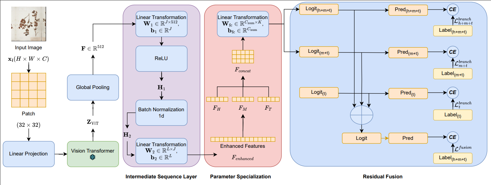

# LTIC-Herb : Long-tailed Image Classification on the Specimens of Herbarium Dataset (IJCNN 2025)

## Overview

Modern transformer-based image encoders have revolutionized computer vision, consistently achieving new benchmarks in various tasks. However, challenges like the long-tail distribution of species in botanical datasets and incomplete representation of rare specimens in herbarium collections hinder accurate classification of diverse plant species. We propose a three-stage approach: leveraging pre-trained transformers for feature extraction, introducing parameter specialization to address class imbalance, and employing a residual fusion mechanism for unified predictions. Evaluations on the Herbarium 2021 and Herbarium 2022 datasets demonstrate state-of-the-art performance across few-shot, medium-shot, and many-shot settings. This work highlights the potential of transformer-based encoders with targeted improvements in advancing biodiversity monitoring and botanical research.

## Results

### Performance on Herbarium Datasets

| Dataset Name   | Epochs | Many-shot | Medium-shot | Few-shot | All   |
|----------------|--------|-----------|-------------|----------|-------|
| Herbarium 2022 | 200    | 77.70     | 75.83       | 75.19    | 76.56 |
| Herbarium 2021 | 200    | 84.20     | 81.24       | 80.19    | 81.03 |

### Comparison with Conviformer-B

| Model          | Dataset        | Test F1 Score |
|----------------|----------------|---------------|
| LTIC           | Herbarium 2022 | 89.31         |
| LTIC           | Herbarium 2021 | 81.88         |
| Conviformer-B  | Herbarium 2022 | 86.8          |
| Conviformer-B  | Herbarium 2021 | 71.9          |

## Usage

To use this model, please adjust the model datapath accordingly in the code (e.g., update the `--data_path` argument in `R50.sh` or `CLIP_VIT_LONGTAIL.py`). Additionally, ensure that the dataset is presized using the `presizer.py` script before training or evaluation. The `presizer.py` script processes images to a target resolution (default 512x512) with central cropping (default 448x448), preparing the Herbarium dataset for optimal model input.

## Acknowledgements

We thank the providers of the Herbarium 2021 and Herbarium 2022 datasets for their contributions to botanical research. We also acknowledge the support of the open-source community, particularly the developers of CLIP and PyTorch, which enabled this work.

## Contact

If you have any questions, feel free to contact us through email (raiyan2025@gmail.com) or GitHub issues. Enjoy!
